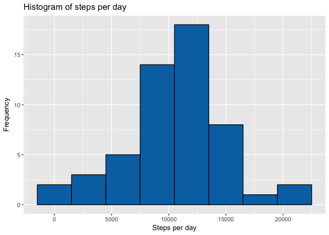
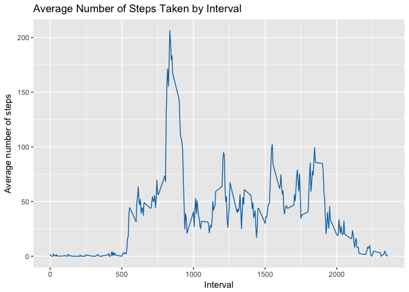
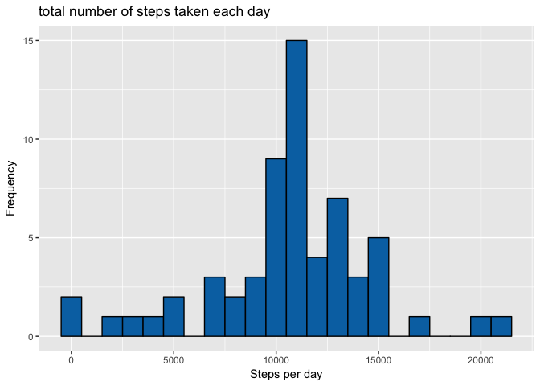
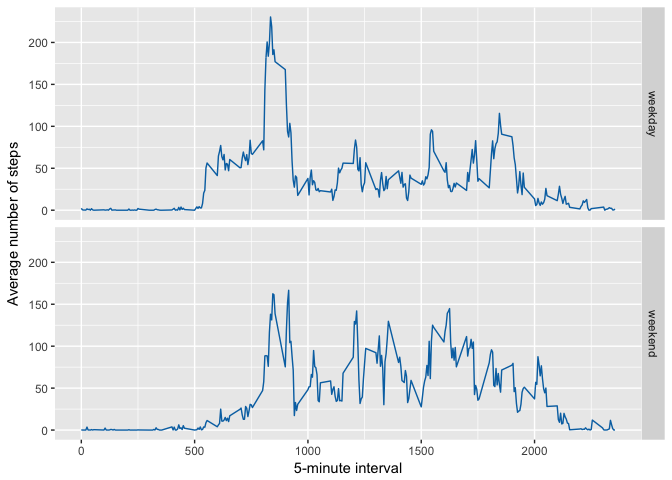

# Reproducible Research: Peer Assessment 1

### Silvain de Munck


```r
library(ggplot2)
library(tidyverse)
```

```
## Loading tidyverse: tibble
## Loading tidyverse: tidyr
## Loading tidyverse: readr
## Loading tidyverse: purrr
## Loading tidyverse: dplyr
```

```
## Conflicts with tidy packages ----------------------------------------------
```

```
## filter(): dplyr, stats
## lag():    dplyr, stats
```


## Loading and preprocessing the data

```r
activity_data <- read.csv("activity.csv")
```


## What is mean total number of steps taken per day?
### 1. Calculate the total number of steps taken per day

```r
steps_by_day <- aggregate(steps ~ date, activity_data, sum)
```


```r
head(steps_by_day)
```

```
##         date steps
## 1 2012-10-02   126
## 2 2012-10-03 11352
## 3 2012-10-04 12116
## 4 2012-10-05 13294
## 5 2012-10-06 15420
## 6 2012-10-07 11015
```
### 2. Make a histogram of the total number of steps taken each day

```r
ggplot(data = steps_by_day, aes(steps_by_day$steps)) + 
     geom_histogram(fill = "#0072B2", binwidth = 3000, colour="#000000") +
     labs(title = "Histogram of steps per day", x = "Steps per day", y = "Frequency")
```

<!-- -->

### 3. Calculate and report the mean and median of the total number of steps taken per day

```r
mean_steps_by_day <- mean(steps_by_day$steps)
mean_steps_by_day
```

```
## [1] 10766.19
```

```r
median_steps_by_day <- median(steps_by_day$steps)
median_steps_by_day
```

```
## [1] 10765
```


## What is the average daily activity pattern?
### 1. Make a time series plot (i.e. r 𝚝𝚢𝚙𝚎 = "𝚕") of the 5-minute interval (x-axis) and the average number of steps taken, averaged across all days (y-axis)

```r
steps_by_interval <- aggregate(steps ~ interval, activity_data, mean)
ggplot(steps_by_interval, aes(interval, steps)) + 
     geom_line(colour = "#0072B2") + 
     ggtitle("Average Number of Steps Taken by Interval") +
     ylab("Average number of steps") + 
     xlab("Interval")
```

<!-- -->

### 2. Which 5-minute interval, on average across all the days in the dataset, contains the maximum number of steps?

```r
max_interval <- steps_by_interval[which.max(steps_by_interval$steps), 1]
max_interval
```

```
## [1] 835
```


## Imputing missing values
### 1. Calculate and report the total number of missing values in the dataset (i.e. the total number of rows with 𝙽𝙰s)

```r
incomplete <- sum(!complete.cases(activity_data))
incomplete
```

```
## [1] 2304
```

### 2. Strategy for filling in all of the missing values in the dataset
See 3

### 3. Create a new dataset that is equal to the original dataset but with the missing data filled in

```r
fill_value <- function(steps, interval) {
  filled <- NA
  if (!is.na(steps))
    filled <- c(steps)
  else
    filled <- (steps_by_interval[steps_by_interval$interval == interval, "steps"])
  return(filled)
}
filled_data <- activity_data
filled_data$steps <- mapply(fill_value, filled_data$steps, filled_data$interval)
```

### 4.a. Make a histogram of the total number of steps taken each day

```r
total_steps <- filled_data %>%
     filter(!is.na(steps)) %>%
     group_by(date) %>%
     summarize(steps = sum(steps))
```


```r
ggplot(data = total_steps, aes(x = steps, y = )) + 
     geom_histogram(fill = "#0072B2", binwidth = 1000, colour="#000000") +
     labs(title = "total number of steps taken each day", x = "Steps per day", y = "Frequency")
```

<!-- -->

### 4.b. Calculate and report the mean and median total number of steps taken per day

```r
mean_total_steps <- mean(total_steps$steps, na.rm = TRUE)
mean_total_steps
```

```
## [1] 10766.19
```

```r
median_total_steps <- median(total_steps$steps, na.rm = TRUE)
median_total_steps
```

```
## [1] 10766.19
```

### 4.c. Do these values differ from the estimates from the first part of the assignment?
Mean is the same, median has increased by 1.19


## Are there differences in activity patterns between weekdays and weekends?
### 1. Create a new factor variable in the dataset with two levels – “weekday” and “weekend”

```r
filled_data$dateType <-  ifelse(as.POSIXlt(filled_data$date)$wday %in% c(0,6), 'weekend', 'weekday')
```

### 2. Make a panel plot containing a time series plot (i.e. 𝚝𝚢𝚙𝚎 = "𝚕") of the 5-minute interval (x-axis) and the average number of steps taken, averaged across all weekday days or weekend days (y-axis)

```r
averaged_filled_data <- aggregate(steps ~ interval + dateType, data = filled_data, mean)
library(ggplot2)
ggplot(averaged_filled_data, aes(interval, steps)) + 
    geom_line(colour = "#0072B2") + 
    facet_grid(dateType ~ .) +
    xlab("5-minute interval") + 
    ylab("Average number of steps")
```

<!-- -->
