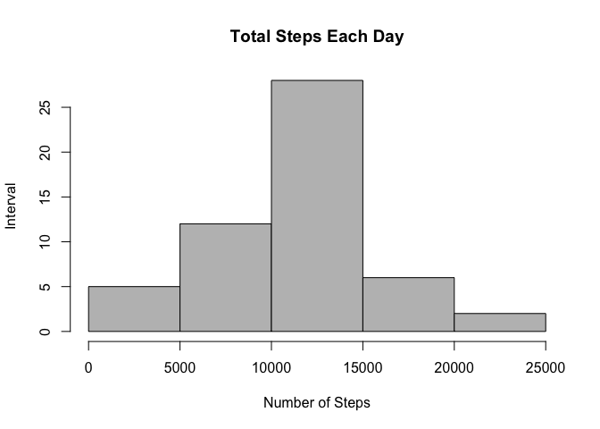
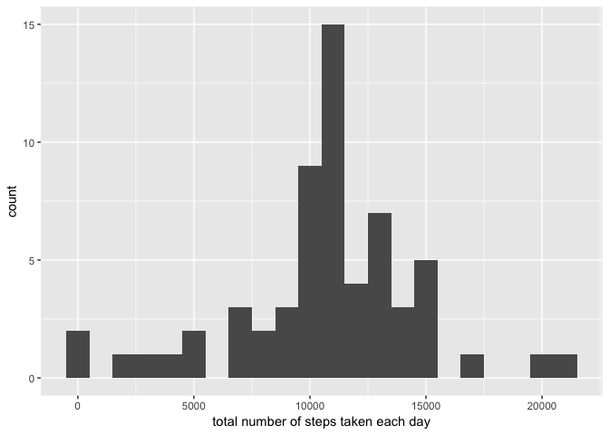
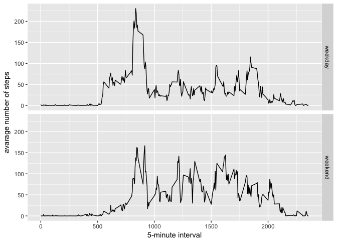

# Reproducible Research: Peer Assessment 1

library(ggplot2)

## Loading and preprocessing the data

```r
activity_data <- read.csv("activity.csv")
```

## What is mean total number of steps taken per day?
### 1. Calculate the total number of steps taken per day

```r
steps_by_day <- aggregate(steps ~ date, activity_data, sum)
```

### 2. Make a histogram of the total number of steps taken each day

```r
hist(steps_by_day$steps, main = paste("Total Steps Each Day"), col = "Gray", 
xlab = "Number of Steps", ylab = "Interval")
```

<!-- -->

### 3. Calculate and report the mean and median of the total number of steps taken per day

```r
rmean <- mean(steps_by_day$steps)
rmean
```

```
## [1] 10766.19
```

```r
rmedian <- median(steps_by_day$steps)
rmedian
```

```
## [1] 10765
```

## What is the average daily activity pattern?
### 1. Make a time series plot (i.e. 𝚝𝚢𝚙𝚎 = "𝚕") of the 5-minute interval (x-axis) and the average number of steps taken, averaged across all days (y-axis)

```r
steps_by_interval <- aggregate(steps ~ interval, activity_data, mean)
plot(steps_by_interval$interval,steps_by_interval$steps, type="l", xlab="Interval", ylab="Number ofSteps",main="Average Number of Steps per Day by Interval")
```

<!-- -->

### 2. Which 5-minute interval, on average across all the days in the dataset, contains the maximum number of steps?

```r
max_interval <- steps_by_interval[which.max(steps_by_interval$steps),1]
max_interval
```

```
## [1] 835
```

## Imputing missing values
### 1. Calculate and report the total number of missing values in the dataset (i.e. the total number of rows with 𝙽𝙰s)

```r
incomplete <- sum(!complete.cases(activity_data))
incomplete
```

```
## [1] 2304
```

### 2. Strategy for filling in all of the missing values in the dataset

### 3. Create a new dataset that is equal to the original dataset but with the missing data filled in

```r
fill_value <- function(steps, interval) {
  filled <- NA
  if (!is.na(steps))
    filled <- c(steps)
  else
    filled <- (steps_by_interval[steps_by_interval$interval==interval, "steps"])
  return(filled)
}
filled_data <- activity_data
filled_data$steps <- mapply(fill_value, filled_data$steps, filled_data$interval)
```

### 4.a. Make a histogram of the total number of steps taken each day

```r
total_steps <- tapply(filled_data$steps, filled_data$date, FUN=sum)
```


```r
ggplot2::qplot(total_steps, binwidth=1000, xlab="total number of steps taken each day")
```

<!-- -->

### 4.b. Calculate and report the mean and median total number of steps taken per day

```r
mean(total_steps)
```

```
## [1] 10766.19
```

```r
median(total_steps)
```

```
## [1] 10766.19
```

### 4.c. Do these values differ from the estimates from the first part of the assignment?
### Mean is the same, median has increased by 1.19

## Are there differences in activity patterns between weekdays and weekends?
### Create a new factor variable in the dataset with two levels – “weekday” and “weekend”

```r
filled_data$dateType <-  ifelse(as.POSIXlt(filled_data$date)$wday %in% c(0,6), 'weekend', 'weekday')
```


### Make a panel plot containing a time series plot (i.e. 𝚝𝚢𝚙𝚎 = "𝚕") of the 5-minute interval (x-axis) and the average number of steps taken, averaged across all weekday days or weekend days (y-axis)

```r
averaged_filled_data <- aggregate(steps ~ interval + dateType, data = filled_data, mean)
library(ggplot2)
ggplot(averaged_filled_data, aes(interval, steps)) + 
    geom_line() + 
    facet_grid(dateType ~ .) +
    xlab("5-minute interval") + 
    ylab("avarage number of steps")
```

<!-- -->
